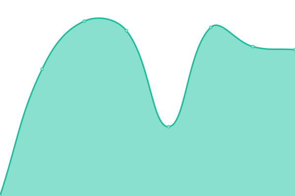
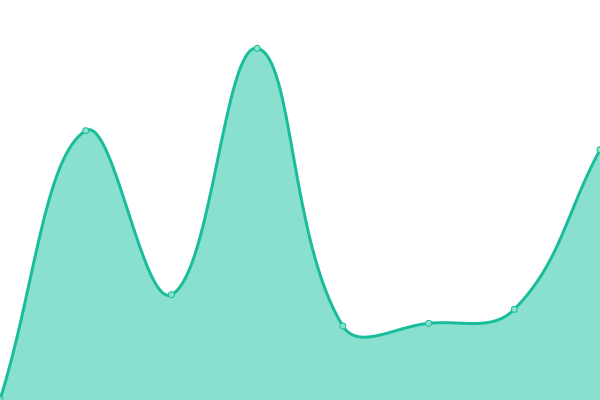
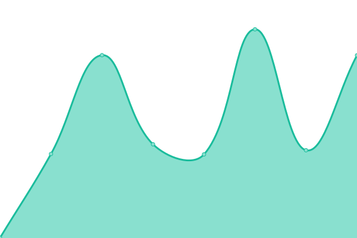

# [📈 Live Status](https://demo.upptime.js.org): <!--live status--> **🟩 All systems operational**

This repository contains the open-source uptime monitor and status page for [Upptime](https://upptime.js.org), powered by [Upptime](https://github.com/upptime/upptime).

With [Upptime](https://upptime.js.org), you can get your own unlimited and free uptime monitor and status page, powered entirely by a GitHub repository. We use [Issues](https://github.com/upptime/upptime/issues) as incident reports, [Actions](https://github.com/spences10/upptime/actions) as uptime monitors, and [Pages](https://demo.upptime.js.org) for the status page.

<!--start: status pages-->
<!-- This summary is generated by Upptime (https://github.com/upptime/upptime) -->
<!-- Do not edit this manually, your changes will be overwritten -->
<!-- prettier-ignore -->
| URL | Status | History | Response Time | Uptime |
| --- | ------ | ------- | ------------- | ------ |
|  [Scott Spence](https://scottspence.com) | 🟩 Up | [scott-spence.yml](https://github.com/spences10/upptime/commits/HEAD/history/scott-spence.yml) | 

 218ms
     
 | 

<a href="https://spences10.github.io/upptime/history/scott-spence">100.00%</a>
    

|  [Cheat Sheets](https://cheatsheets.xyz) | 🟩 Up | [cheat-sheets.yml](https://github.com/spences10/upptime/commits/HEAD/history/cheat-sheets.yml) | 

 623ms
     
 | 

<a href="https://spences10.github.io/upptime/history/cheat-sheets">100.00%</a>
    

|  [Password Character Picker](https://cfromp.xyz) | 🟩 Up | [password-character-picker.yml](https://github.com/spences10/upptime/commits/HEAD/history/password-character-picker.yml) | 

 728ms
     
 | 

<a href="https://spences10.github.io/upptime/history/password-character-picker">100.00%</a>
    

|  [Svelte Bits](https://sveltebits.com) | 🟩 Up | [svelte-bits.yml](https://github.com/spences10/upptime/commits/HEAD/history/svelte-bits.yml) | 

 919ms
     
 | 

<a href="https://spences10.github.io/upptime/history/svelte-bits">100.00%</a>
    

|  [Short Links](https://ss10.dev/links) | 🟩 Up | [short-links.yml](https://github.com/spences10/upptime/commits/HEAD/history/short-links.yml) | 

 873ms
     
 | 

<a href="https://spences10.github.io/upptime/history/short-links">100.00%</a>
    

<!--end: status pages-->

[**Visit our status website →**](https://demo.upptime.js.org)

## 📄 License

- Powered by: [Upptime](https://github.com/upptime/upptime)
- Code: [MIT](./LICENSE) © [Upptime](https://upptime.js.org)
- Data in the `./history` directory: [Open Database License](https://opendatacommons.org/licenses/odbl/1-0/)
